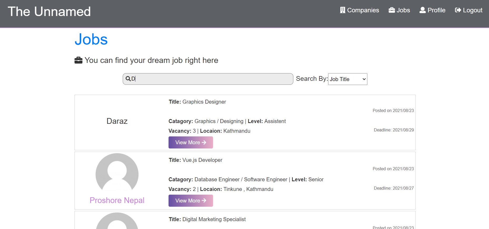
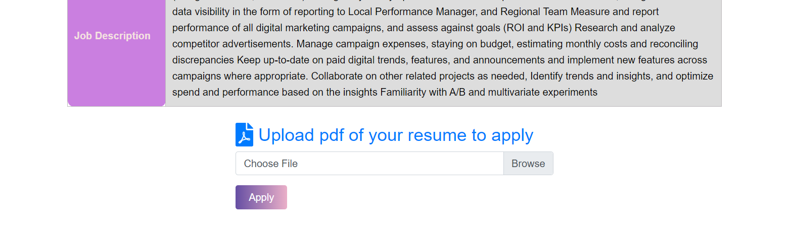
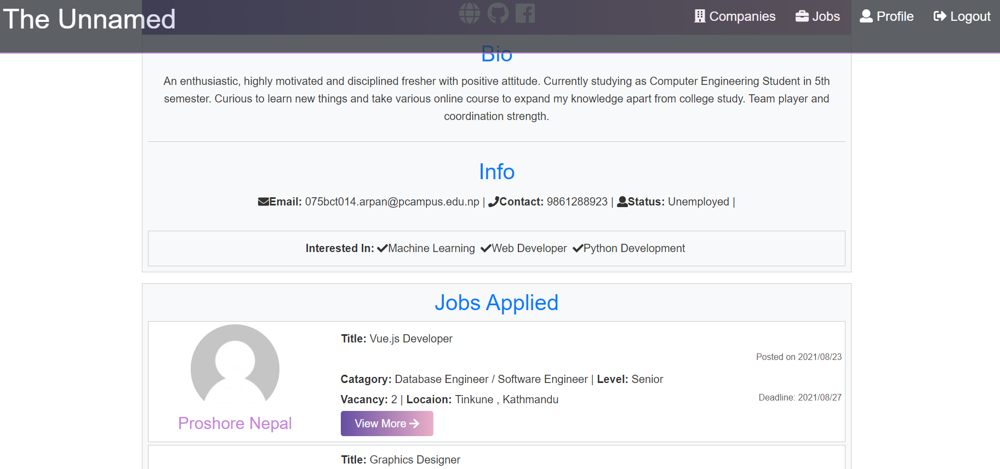
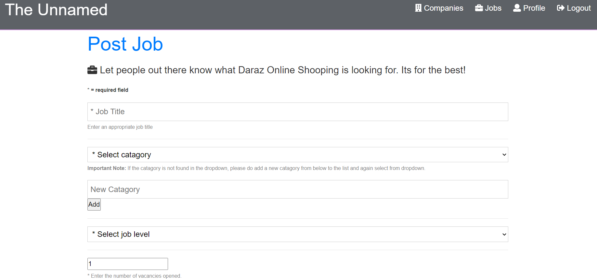
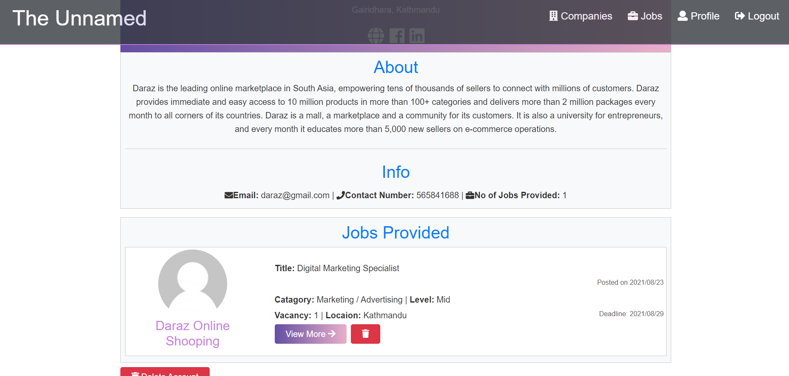
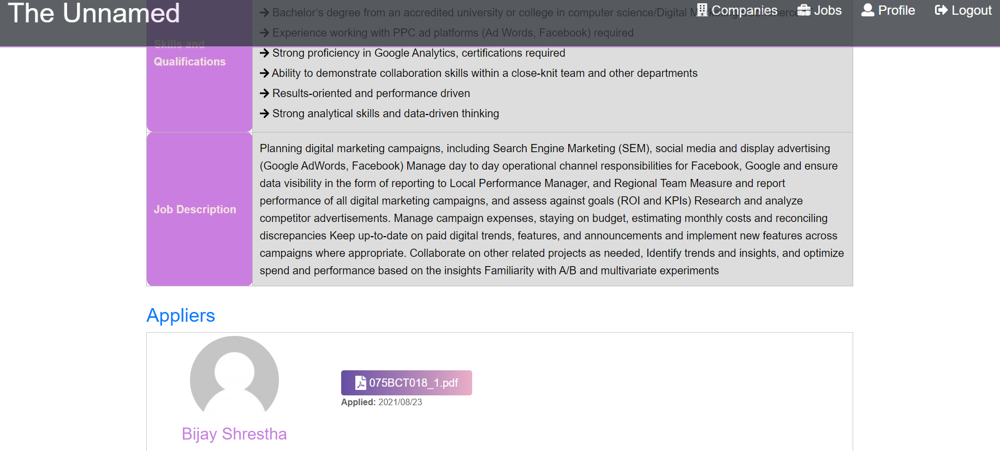
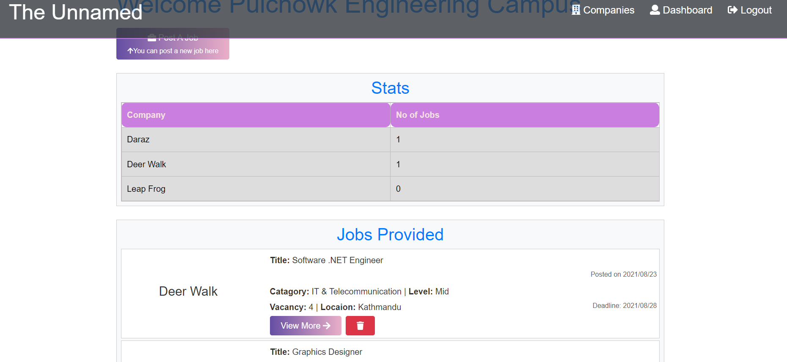

# The Unnamed: A Job Hosting Web App

> Developed by teams members involving Arpan Gyawali, Bijay Shrestha, Bidhan Khatiwada and Aakash Panthi from Pulchowk Engineering campus as a minor project of Software Engineering.

Here, Recruiter companies can provide job opportunity for the people out there seeking for jobs in a convinient way. This benefits companies as well as job seekers.

[Visit our website](https://damp-spire-73123.herokuapp.com/)

## Here are some screenshots

**For Seekers**

- Search and View Jobs
  

- Apply job
  

- Apply job
  

**For Recruiters**

- Add job
  

- See job posted
  

- See appliers
  

**Note:**
[For admin login](https://damp-spire-73123.herokuapp.com/login-admin/)

Admin can also post jobs provided by different company for organization students only.They need special access.

**For admin**

## How to clone the app and change according to your need

cd "project folder"

npm install "packages for backend"

cd client

npm install "packages forfrontend"

change environment variables of yourself
